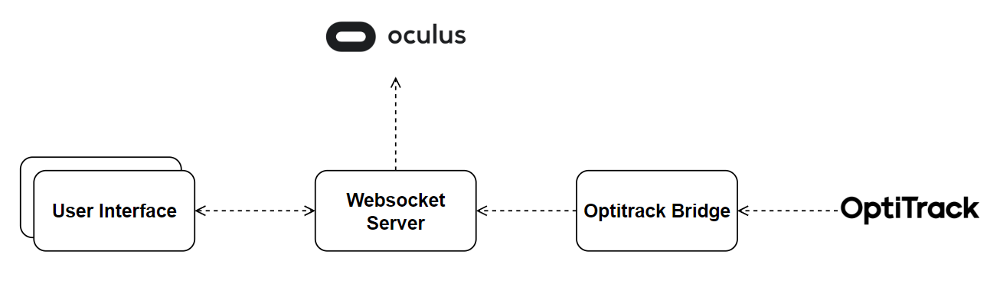

# Websocket Server
This repository has been developed as part of the project *"Mixed Reality Environment For Harvesting Study"* done by Alessandro Dalbesio.

## Getting started
This is the websocket implementation needed for implementing a dual-way real time communication between the devices. <br><br>
The main functionalities that this server implements are:
- Real time synchronization between all the devices
- Real time synchronization between the optitrack and the headset

A schema of the connection of the Websocket Server is shown below: <br>


## Installation
It's highly recomended to install this repository directly with the [server](https://gitlab.epfl.ch/create-lab/sensing-with-vr/server) installer. <br>
You can easily modify the settings of the Websocket Server by modifying the <code>settings.py</code> file. <br>
Some of the parameters are imported from the file <code>settings.json</code> to be able to define some parameters directly from the [server](https://gitlab.epfl.ch/create-lab/sensing-with-vr/server) installer. <br><br>
If you wish to install the Websocket Server without the installer you should create a <code>settings.json</code> file with the following structure (you can change the values):
```json
{
    "WEBSOCKET_SERVER_PORT": 8080,
    "WEBSOCKET_SERVER_ADDRESS": "localhost"
}
```
All the required packages are listed in the <code>requirements.txt</code> file. <br>

## Authors
This repository is part of the project "Mixed Reality Environment For Harvesting Study" done by Alessandro Dalbesio 352298.<br>
The project has been done in the CREATE LAB (EPFL).<br>
Professor: Josie Hughes<br>
Supervisor: Ilic Stefan<br>

## License
This project is under [MIT] license